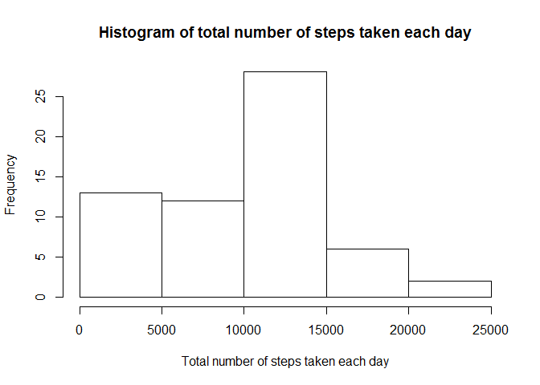
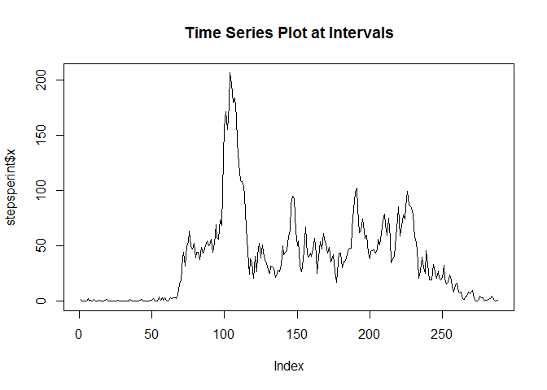
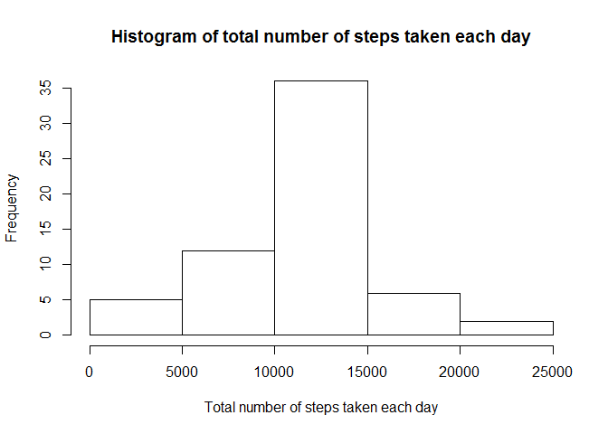
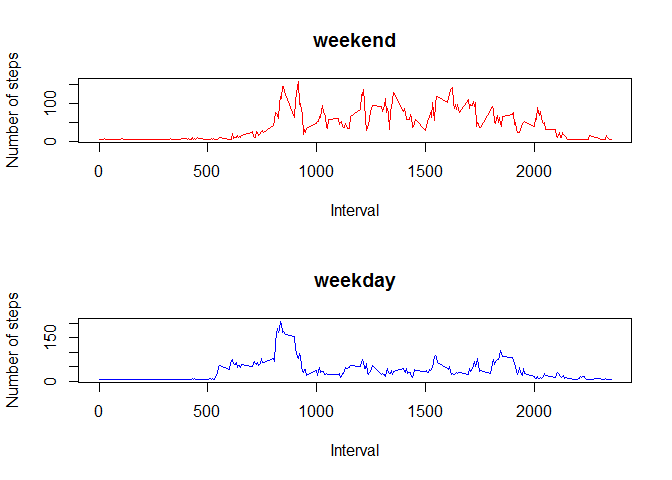

# Reproducible Research: Peer Assessment 1
Raja Pasupuleti  


## Loading and preprocessing the data

```r
activity_data <- read.csv("activity.csv",header=TRUE,sep=",")
head(activity_data)
```

```
##   steps       date interval
## 1    NA 2012-10-01        0
## 2    NA 2012-10-01        5
## 3    NA 2012-10-01       10
## 4    NA 2012-10-01       15
## 5    NA 2012-10-01       20
## 6    NA 2012-10-01       25
```


## What is mean total number of steps taken per day?

1. Make a histogram of the total number of steps taken each day


```r
stepsperday <- aggregate(activity_data$steps, list(activity_data$date), sum, na.rm=TRUE)
#stepsperday
hist(stepsperday[,2],
      main = "Histogram of total number of steps taken each day", 
      xlab = "Total number of steps taken each day")
```

 

2. Calculate and report the **mean** and **median** total number of steps taken per day


```r
mean_steps_each_day <-mean(stepsperday[,2], na.rm=TRUE)
print(paste0("Mean Steps taken per day :",mean_steps_each_day))
```

```
## [1] "Mean Steps taken per day :9354.22950819672"
```

```r
median_steps_each_day <- median(stepsperday[,2], na.rm=TRUE)
print(paste0("Median Steps taken per day :",median_steps_each_day))
```

```
## [1] "Median Steps taken per day :10395"
```


## What is the average daily activity pattern?
1. Make a time series plot (i.e. `type = "l"`) of the 5-minute interval (x-axis) and the average number of steps taken, averaged across all days (y-axis)


```r
stepsperint <- aggregate(activity_data$steps, list(activity_data$interval), mean, na.rm=TRUE)
plot(stepsperint$x, type="l", main="Time Series Plot at Intervals")
```

 

2. Which 5-minute interval, on average across all the days in the dataset, contains the maximum number of steps?


```r
max_no_of_steps <- which.max(stepsperint[,2])
print(paste0(stepsperint[max_no_of_steps,1], " is the maximum  5-min interval across all days of the dataset"))
```

```
## [1] "835 is the maximum  5-min interval across all days of the dataset"
```


## Imputing missing values

1. Calculate and report the total number of missing values in the dataset (i.e. the total number of rows with `NA`s)

check for missing value in "date"" ,"interval","steps"


```r
dim(activity_data)
```

```
## [1] 17568     3
```

```r
length(which(is.na(activity_data$date)))
```

```
## [1] 0
```

```r
length(which(is.na(activity_data$interval)))
```

```
## [1] 0
```

```r
length(which(is.na(activity_data$steps)))
```

```
## [1] 2304
```

2. Devise a strategy for filling in all of the missing values in the dataset. The strategy does not need to be sophisticated. For example, you could use the mean/median for that day, or the mean for that 5-minute interval, etc.

3. Create a new dataset that is equal to the original dataset but with the missing data filled in.


```r
new_data <- activity_data
new_steps = new_data$steps


for (i in which(sapply(new_data, is.numeric))){
  new_data[is.na(new_data[,i]), i] <- mean(new_data[,i], na.rm=TRUE)
}


head(new_data)
```

```
##     steps       date interval
## 1 37.3826 2012-10-01        0
## 2 37.3826 2012-10-01        5
## 3 37.3826 2012-10-01       10
## 4 37.3826 2012-10-01       15
## 5 37.3826 2012-10-01       20
## 6 37.3826 2012-10-01       25
```

4. Make a histogram of the total number of steps taken each day and Calculate and report the **mean** and **median** total number of steps taken per day. Do these values differ from the estimates from the first part of the assignment? What is the impact of imputing missing data on the estimates of the total daily number of steps?


```r
stepsperday2 <- aggregate(new_data$steps, list(new_data$date), sum, na.rm=TRUE)
hist(stepsperday2[,2],
      main = "Histogram of total number of steps taken each day", 
      xlab = "Total number of steps taken each day")
```

 

```r
mean_steps_each_day <-mean(stepsperday2[,2], na.rm=TRUE)
print(paste0("New Mean Steps taken per day :",mean_steps_each_day))
```

```
## [1] "New Mean Steps taken per day :10766.1886792453"
```

```r
median_steps_each_day <- median(stepsperday2[,2], na.rm=TRUE)
print(paste0("New Median Steps taken per day :",median_steps_each_day))
```

```
## [1] "New Median Steps taken per day :10766.1886792453"
```
The histogram with the new dataset differs from the first part of the assignment. Both Mean and  median values varies increased from the old dataset. Imputing missing data increases the overall counts of total daily number of steps, as  missing values which were ignored in the first part are now replaced with meaningful values and moth mean and median values increased.


## Are there differences in activity patterns between weekdays and weekends?


1. Create a new factor variable in the dataset with two levels -- "weekday" and "weekend" indicating whether a given date is a weekday or weekend day.

1. Make a panel plot containing a time series plot (i.e. `type = "l"`) of the 5-minute interval (x-axis) and the average number of steps taken, averaged across all weekday days or weekend days (y-axis). The plot should look something like the following, which was created using **simulated data**:

A new column named "day_type" is added to indicate whether a given date is a weekday or weekend day.


```r
new_data$date <- as.Date(new_data$date)
weekdays0 <- c('Monday', 'Tuesday', 'Wednesday', 'Thursday', 'Friday')
new_data$day_type <- factor((weekdays(new_data$date) %in% weekdays0), levels = c(FALSE, TRUE), labels = c('weekend', 'weekday'))
head(new_data)
```

```
##     steps       date interval day_type
## 1 37.3826 2012-10-01        0  weekday
## 2 37.3826 2012-10-01        5  weekday
## 3 37.3826 2012-10-01       10  weekday
## 4 37.3826 2012-10-01       15  weekday
## 5 37.3826 2012-10-01       20  weekday
## 6 37.3826 2012-10-01       25  weekday
```
the average number of steps taken on weekdays:


```r
new_data_weekday = new_data[which(new_data$day_type == "weekday"),]
new_data_steps_weekday = new_data_weekday$steps
new_data_date_weekday = new_data_weekday$date
new_data_interval_weekday = new_data_weekday$interval
new_data_interval_average_weekday = aggregate(new_data_steps_weekday ~ new_data_interval_weekday, FUN = mean, na.action = na.omit)
```

average number of steps taken on weekends: 


```r
new_data_weekend = new_data[which(new_data$day_type == "weekend"),]
new_data_steps_weekend = new_data_weekend$steps
new_data_date_weekend = new_data_weekend$date
new_data_interval_weekend = new_data_weekend$interval
new_data_interval_average_weekend = aggregate(new_data_steps_weekend ~ new_data_interval_weekend, FUN = mean, na.action = na.omit)
```
plot containing a time series plot of the 5-minute interval (x-axis) and the average number of steps taken, averaged across all weekday days or weekend days (y-axis). 


```r
par(mfrow=c(2,1))
plot(new_data_interval_average_weekend$new_data_interval_weekend,
    new_data_interval_average_weekend$new_data_steps_weekend,
    type="l",
    main = "weekend",
    xlab = "Interval",  
    ylab = "Number of steps",
    col="red")

plot(new_data_interval_average_weekday$new_data_interval_weekday,
     new_data_interval_average_weekday$new_data_steps_weekday,
     type = "l", 
     main = "weekday", 
     xlab = "Interval",  
     ylab = "Number of steps",
     col="blue")
```

 


### Yes, there are differences in activity patterns between weekdays and weekends as described in above two plots
